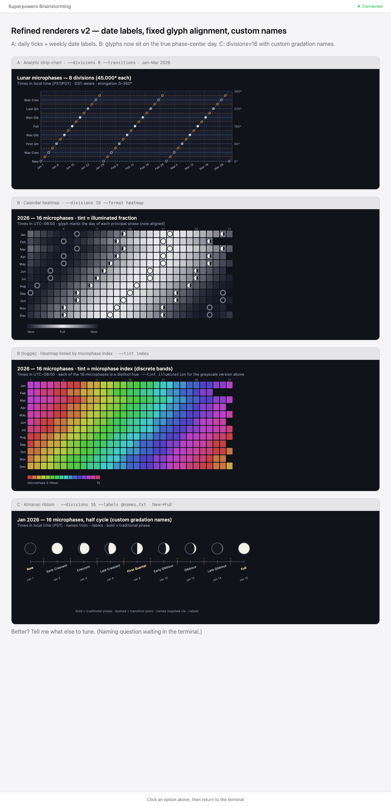

# moonphase

Compute and chart **microphases** of the Moon — arbitrary divisions of the
synodic cycle — across a date range of any length, and pin down the **exact
instant** of every phase.

The standard four phases (new, first quarter, full, last quarter) are just
`--divisions 4`. Want 32 phases? `--divisions 32`. Want one tick per degree of
Sun–Moon elongation? `--step 1deg` (= 360 microphases per cycle).

## Concepts

The synodic cycle is 360° of Sun–Moon elongation: 0° = new, 90° = first quarter,
180° = full, 270° = last quarter.

- **Microphase (phase)** — one of `N` equal arcs of the cycle, **centered on**
  its phase center. For `--divisions 4` the microphases are the classical phases.
  "Phase" and "microphase" are synonyms; *microphase* just emphasizes that `N`
  is arbitrary.
- **Phase center** — the angle `k·step` at the *middle* of microphase `k` (the
  exact New-moon instant, Full-moon instant, …). These are what event mode
  locates precisely.
- **Transition point** — the angle `(k+½)·step`, the boundary *between* two
  adjacent microphases. A separate, opt-in category (`--transitions`), not a
  finer division.

Two ways to get data out:

- **`--mode series`** (default) — sample the phase angle at a fixed cadence
  (`--sample`, default 1h) and bucket each sample into a microphase. Good for
  charts and dense time-series.
- **`--mode events`** — root-find the **exact** UTC instants of each phase
  center (and, with `--transitions`, each transition point) to sub-second
  precision, independent of cadence. Requires a step that divides 360° evenly
  (every `--divisions` scheme qualifies).

`--mode` auto-resolves from `--format` when omitted, so you rarely need it.

## Installation

Requires **Python ≥ 3.10**.

> **Note:** moonphase is not yet published to PyPI. The `pip install moonphase`
> line below is a placeholder for the planned release — for now, install from
> source.

```bash
# From PyPI (planned — not yet available)
pip install moonphase

# From source (works today)
git clone https://github.com/Bezoar/moonphase.git
cd moonphase
python -m venv .venv && source .venv/bin/activate
pip install -e .          # use ".[dev]" to also get pytest + ruff
```

This installs the `moonphase` console script (also runnable as
`python -m moonphase.cli`). The JPL DE421 ephemeris (~17 MB) downloads to
`./data/` on first use — see [Ephemeris](#ephemeris).

## Usage

Every run needs a date range and a division scheme
(`--divisions N` *or* `--step Xdeg`); everything else has defaults.

### Series mode (default) — sampled time-series

```bash
# 32 microphases across 2026 as a PNG strip-chart
moonphase --start 2026-01-01 --end 2026-12-31 --divisions 32 --out chart.png

# 1°-resolution phase angle for January as CSV (360 microphases per cycle)
moonphase --start 2026-01-01 --end 2026-01-31 --step 1deg --format csv --out jan.csv

# 8-phase terminal calendar — one row of moon glyphs per day
moonphase --start 2026-01-01 --end 2026-01-31 --divisions 8 --format terminal

# Tighter sampling cadence (default is 1h)
moonphase --start 2026-01-01 --end 2026-01-07 --divisions 8 --sample 10m --format json
```

### Events mode — exact instants

```bash
# Exact New / First-Quarter / Full / Last-Quarter instants for 2026, as CSV
moonphase --start 2026-01-01 --end 2026-12-31 --divisions 4 \
          --mode events --format csv --out phases-2026.csv

# ...also include the transition points (the midpoints between phases)
moonphase --start 2026-01-01 --end 2026-12-31 --divisions 4 \
          --mode events --transitions --format json --out phases-2026.json

# Events to stdout (omit --out)
moonphase --start 2026-03-01 --end 2026-03-31 --divisions 8 --mode events
```

`--mode` is optional — it auto-resolves from `--format` (multi-mode formats
default to `series`). `--sample` applies only in series mode. Events mode needs a
step that divides 360° evenly, which every `--divisions N` satisfies.

### Calendar & almanac views

```bash
# Year heatmap tinted by microphase index (16 hues)
moonphase --start 2026-01-01 --end 2026-12-31 --divisions 16 \
          --format heatmap --tint index --out year.png

# Lunar-month heatmap: one phase-aligned strip per lunation (new-moon boundaries)
moonphase --start 2026-01-01 --end 2026-12-31 --divisions 16 \
          --format heatmap --calendar lunar --out lunar.png

# Almanac ribbon of the principal phases (+ transitions) for a quarter
moonphase --start 2026-01-01 --end 2026-03-31 --divisions 4 \
          --format almanac --transitions --out almanac.svg

# Custom names: rename the four phases (inline), or name 16 gradations from a file
moonphase --start 2026-01-01 --end 2026-03-31 --divisions 4 --format almanac \
          --labels "Dark Moon,Building,Bright Moon,Fading" --out named.svg
moonphase --start 2026-01-01 --end 2026-12-31 --divisions 16 --format chart \
          --labels @names16.txt --out year-named.png
```

`heatmap` is series-mode; `almanac` is events-mode — both auto-resolve `--mode`.
`--labels` accepts an inline comma list or `@file` (one name per line, or a JSON
`index→name` map); unnamed slots fall back to the built-in names (for 4/8 divisions)
or the microphase index.

> **Timezones:** bare dates use your local time; pass an ISO offset
> (e.g. `2026-01-01T00:00-08:00` or `…Z`) to pin a zone. Output carries the
> offset, conversions are DST-aware, and every render states its timezone.

## CLI

```
moonphase --start DATE --end DATE
          (--divisions N | --step Xdeg)
          [--mode {series,events}]   # default: auto from --format, else series
          [--transitions]            # include transition points
          [--sample DUR]             # series cadence (e.g. 30m, 1h, 2d); series mode only
          [--format {chart,heatmap,almanac,csv,json,terminal}]
          [--theme {dark,light}]     # color theme (default: dark)
          [--tint {illumination,index}]        # heatmap cell tint
          [--calendar {gregorian,lunar}]       # heatmap layout
          [--lunar-anchor {new,full}]          # lunar-month boundary
          [--size WxH]               # output image size in px (e.g. 5000x3000)
          [--cell-times]             # heatmap: print transition times in cells (needs --transitions, gregorian)
          [--font NAME|PATH]         # font family name or .ttf/.otf path for heatmap text
          [--labels SPEC]            # custom names: "A,B,C" or @file (sparse-merge)
          [--out PATH]               # stdout / window if omitted, where applicable
          [--ephemeris PATH.bsp]     # override the bundled-kernel download
```

`--start`/`--end` accept `YYYY-MM-DD` or full ISO 8601. Exactly one of
`--divisions` / `--step` is required.

## Renderers

Renderers are a pluggable registry; each declares which modes it supports.
`--format` choices come from the registry.

| Format | Modes | Output |
|--------|-------|--------|
| `chart` | series, events | Matplotlib strip-chart of elongation vs time — centered phase bands, named phases on the left axis / degrees on the right, with exact-event overlays (solid = phase centers, dashed = transitions). File type inferred from `--out` extension (png/svg/pdf/…). |
| `heatmap` | series | Calendar grid. `--calendar gregorian` (months × days, cells tinted, principal-phase day markers) or `--calendar lunar` (one phase-aligned strip per lunation, dated by `--lunar-anchor`). `--tint illumination` (grayscale by lit fraction) or `--tint index` (a hue per microphase). With `--cell-times` (gregorian + `--transitions` only), each day cell also prints the time(s) a microphase transition took effect, in low-contrast text; the figure is auto-sized so 9 pt text fits (override or enlarge with `--size`, restyle with `--font`). |
| `almanac` | events | Ribbon of rendered moon disks at each exact phase center (name + date + time), with transition points dashed between. |
| `csv` | series, events | Sample rows, or exact-event rows (`time, target_angle_deg, kind, microphase_index, name, …`). |
| `json` | series, events | `{scheme, samples}` or `{scheme, events}`. |
| `terminal` | series, events | One row per day of Unicode moon glyphs (series), or a list of exact events. |

Adding a renderer is a single file: define `render(report, out)`, decorate with
`@register("name", modes={...})`, add one import line — no changes to the CLI or
the calendar/events core.

## Design mockups

The image below is the original **design mockup** (rendered in a browser during
design, with placeholder dates). All three renderer families are now implemented;
actual output closely follows these targets:



- **A · Analytic strip-chart** — the `chart` renderer (Phase 1).
- **B · Calendar heatmap** (illumination / microphase-index tints + lunar-month layout) — the `heatmap` renderer (Phase 3).
- **C · Almanac moon ribbon** — the `almanac` renderer (Phase 3).

## Sample gallery

Actual rendered output of every chart for **2026** (at 8 and 16 divisions, plus
custom-label examples) lives in **[`samples/`](samples/README.md)** — each image is
embedded above the exact `moonphase` command that produced it.

## Status & roadmap

**Implemented:**

- **Phase 1** — centered-phase model, exact event-finding (phase centers +
  transition points), the `Report`-based renderer interface with mode
  declarations, the `chart`/`csv`/`json`/`terminal` renderers, and the
  `--mode`/`--transitions` CLI.
- **Phase 2 — Time handling** — local-timezone input (bare dates → local), ISO
  offsets in output, DST-aware conversions, and a timezone caption on every
  time-bearing render.
- **Phase 3 — New renderers & layouts** — the `heatmap` renderer (`--tint
  illumination|index`, `--calendar gregorian|lunar` with `--lunar-anchor`) and the
  `almanac` moon-disk ribbon.
- **Phase 4 — Custom names** — `--labels` (inline or `@file`, sparse-merged over the
  built-in names) for naming the finer gradations.

All four roadmap phases are implemented.

See `docs/specs/primary.md` for the full specification, `docs/superpowers/specs/`
for the design write-up, and `docs/superpowers/plans/` for the phased
implementation plans.

## Ephemeris

Uses [Skyfield](https://rhodesmill.org/skyfield/) with the JPL **DE421** kernel.
The kernel (~17 MB) is downloaded to `./data/` on first use (when a phase angle
is actually computed) and is gitignored. Pass `--ephemeris path/to/de421.bsp` to
use a pre-bundled copy.

DE421 is freely usable under [NAIF's terms](https://naif.jpl.nasa.gov/naif/rules.html)
(redistribution of the unmodified kernel is permitted); it is not bundled in this
repository.

## Public API

```python
from moonphase import (
    MicrophaseScheme,   # .from_divisions(N) / .from_step(deg)
    PhaseEphemeris,     # Skyfield-backed phase-angle lookup
    PhaseSample,        # (when, angle_deg, microphase)
    PhaseEvent,         # (when, angle_deg, kind, index, name)
    Report,             # renderer context: (scheme, mode, samples, events, tz, labels, options)
    build_series,       # sampled series
    build_events,       # exact phase-center / transition instants
    phase_to_index,     # centered microphase bucketing
)
from moonphase import renderers   # register / get / modes_for / available
```

## Development

```bash
pip install -e ".[dev]"
pytest -q          # full suite (offline — uses a synthetic ephemeris, no kernel download)
ruff check src tests
```

## License

MIT. See `LICENSE`.
