# Sample charts — 2026

Rendered output of every visual `moonphase` renderer for the **2026** lunar year, at
**8** and **16** microphase divisions, computed from the real JPL **DE421** ephemeris.

- Times are pinned to **UTC** with the `…Z` suffix; **bare dates** (e.g. `2026-01-01`)
  would instead use your local timezone, and the caption/timestamps would change to match.
- Run the commands from the **repository root**. The `moonphase` console script is installed
  by `pip install -e .`; the DE421 kernel (~17 MB) downloads to `./data/` on first use.
- The **almanac** uses a Jan–Feb window (≈2 lunations) — a full-year microphase ribbon would
  be unreadably dense.
- All charts use the default **dark** theme; pass `--theme light` for a light variant (one is
  shown at the end under [Light theme](#light-theme)).

---

## Strip-chart — `chart`

Elongation (0–360°) vs. time; named phases on the left axis, degrees on the right, centered
phase bands, with phase-center markers overlaid.

**8 divisions**

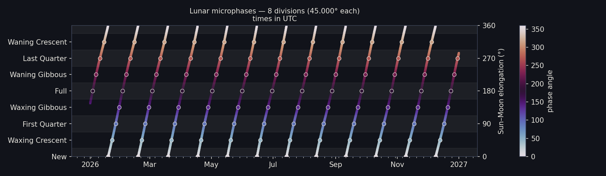

```bash
moonphase --start 2026-01-01T00:00Z --end 2026-12-31T23:00Z \
          --divisions 8 --format chart --out samples/chart-2026-8div.png
```

**16 divisions**

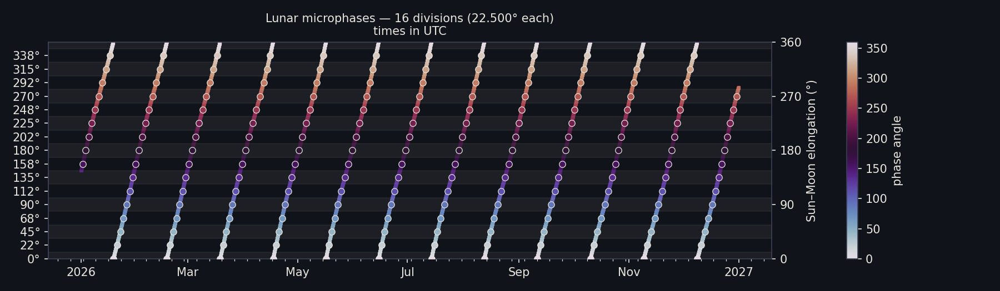

```bash
moonphase --start 2026-01-01T00:00Z --end 2026-12-31T23:00Z \
          --divisions 16 --format chart --out samples/chart-2026-16div.png
```

---

## Calendar heatmap — Gregorian months × days

`--calendar gregorian` (the default): one row per calendar month, one cell per day, with a
moon-disk marker on each principal-phase day.

### `--tint illumination` (grayscale by lit fraction)

**8 divisions**

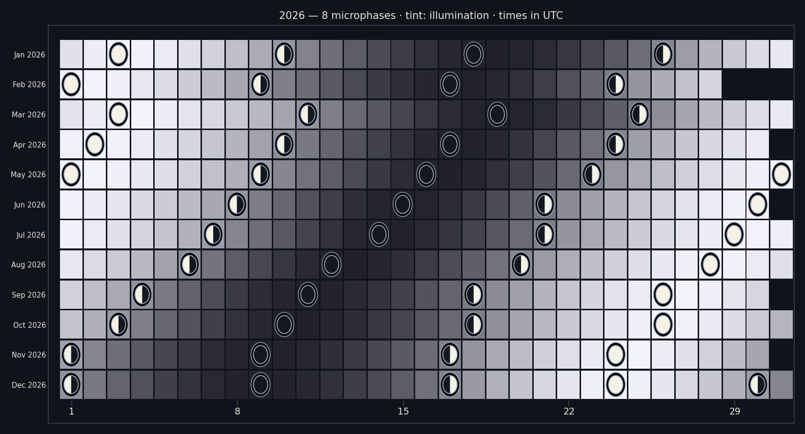

```bash
moonphase --start 2026-01-01T00:00Z --end 2026-12-31T23:00Z \
          --divisions 8 --format heatmap --tint illumination \
          --out samples/heatmap-gregorian-illumination-2026-8div.png
```

**16 divisions**

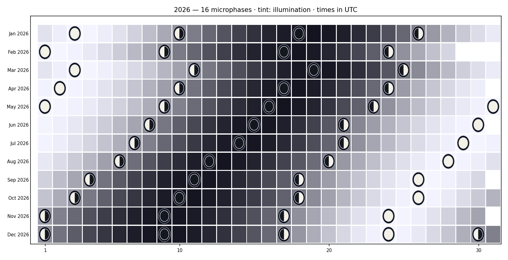

```bash
moonphase --start 2026-01-01T00:00Z --end 2026-12-31T23:00Z \
          --divisions 16 --format heatmap --tint illumination \
          --out samples/heatmap-gregorian-illumination-2026-16div.png
```

### `--tint index` (a distinct hue per microphase)

**8 divisions**

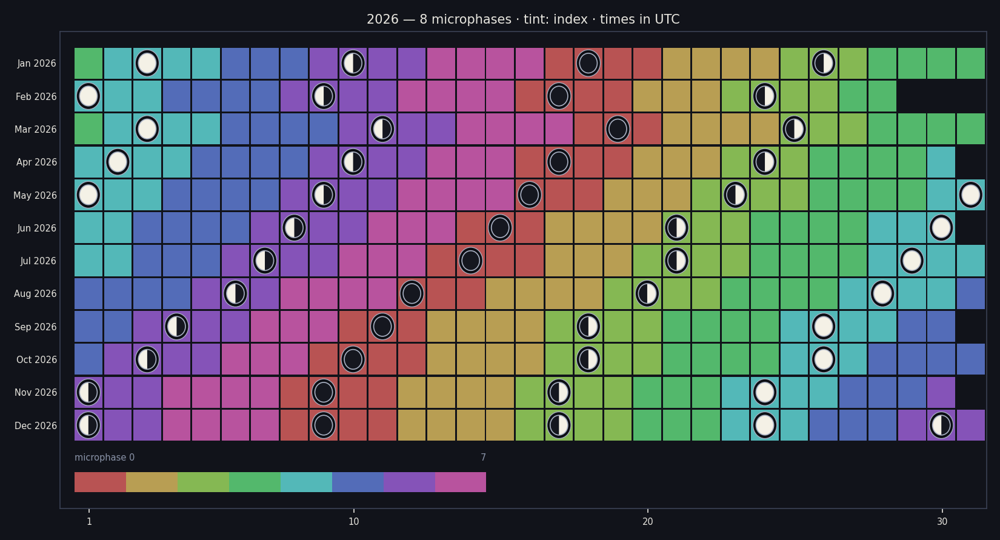

```bash
moonphase --start 2026-01-01T00:00Z --end 2026-12-31T23:00Z \
          --divisions 8 --format heatmap --tint index \
          --out samples/heatmap-gregorian-index-2026-8div.png
```

**16 divisions**

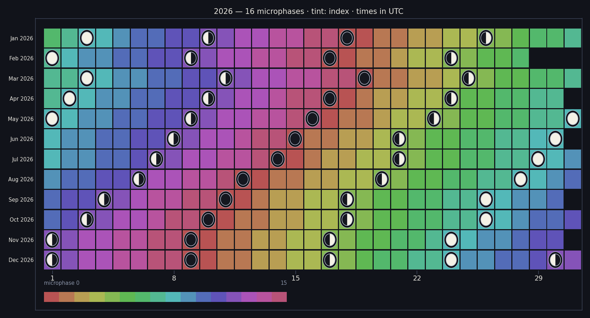

```bash
moonphase --start 2026-01-01T00:00Z --end 2026-12-31T23:00Z \
          --divisions 16 --format heatmap --tint index \
          --out samples/heatmap-gregorian-index-2026-16div.png
```

### Giant heatmap with in-cell transition times — `--cell-times`

With `--cell-times` (gregorian), each day cell prints two kinds of moment in
low-contrast text: a **phase peak** as a bare `code HH:MM` (e.g. `Full 21:23`),
and — when `--transitions` is also given — the **transition into** a phase as
`→code HH:MM` (e.g. `→Full 14:25`). `code` is the `--labels` value (here the
compact codes from [`labels-16-compact.txt`](labels-16-compact.txt)) or the bare
microphase number. Without `--transitions` the cells show peaks only. The
principal phases (New, 1Q, Full, 3Q) appear as plain text like any other phase —
no moon-disk markers. The figure is auto-sized from the labels so 9 pt text stays
legible, which makes it large — **tap the image to open it full-size in a new
tab**.

[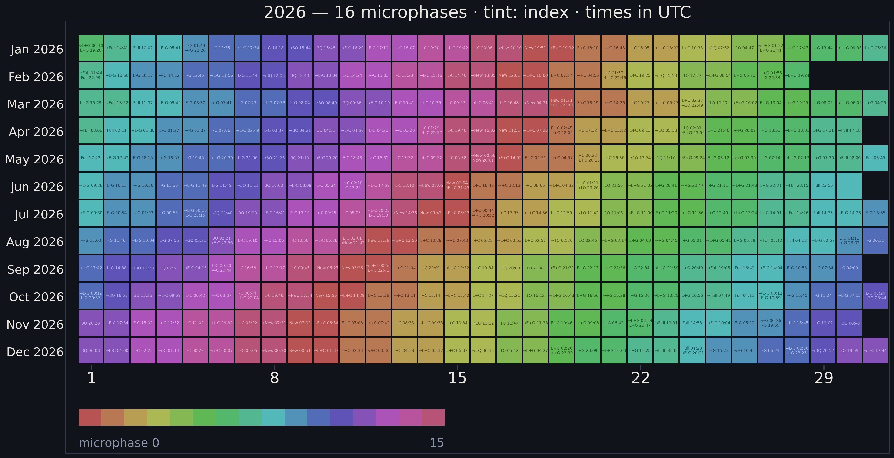](heatmap-cell-times-2026-16div.png)

```bash
moonphase --start 2026-01-01T00:00Z --end 2026-12-31T23:00Z --divisions 16 \
          --transitions --format heatmap --calendar gregorian --tint index --cell-times \
          --labels @samples/labels-16-compact.txt \
          --out samples/heatmap-cell-times-2026-16div.png
```

---

## Almanac ribbon — `almanac`

Rendered moon disks at each exact phase center (name + UTC date/time), with transition
points dashed between. Shown for **Jan–Feb 2026** (≈2 lunations).

**8 divisions**

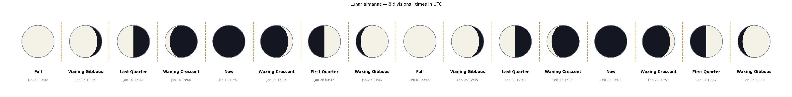

```bash
moonphase --start 2026-01-01T00:00Z --end 2026-02-28T23:00Z \
          --divisions 8 --format almanac --transitions \
          --out samples/almanac-2026-jan-feb-8div.png
```

**16 divisions**

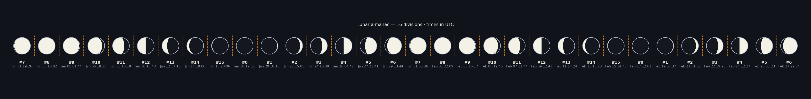

```bash
moonphase --start 2026-01-01T00:00Z --end 2026-02-28T23:00Z \
          --divisions 16 --format almanac --transitions \
          --out samples/almanac-2026-jan-feb-16div.png
```

---

## Custom names — `--labels`

`--labels` renames microphases. Provide an **inline** comma list, or `@file` (one name
per line, or a JSON `index→name` map); unspecified slots fall back to the built-in
names (for 4/8 divisions) or the index.

### Inline names on the strip-chart axis (8 divisions)

The eight phases are renamed on the left axis via an inline comma list.

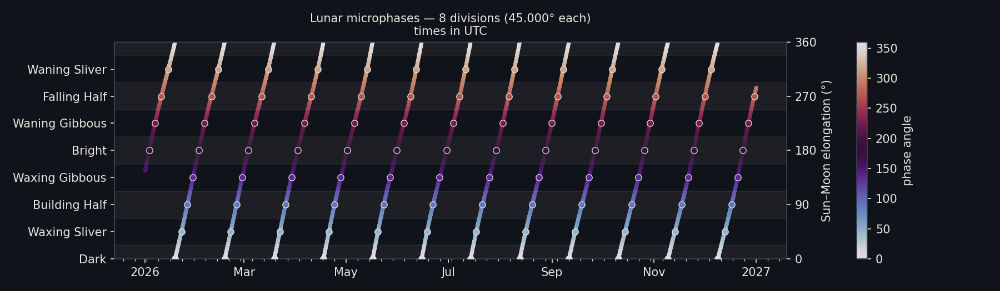

```bash
moonphase --start 2026-01-01T00:00Z --end 2026-12-31T23:00Z --divisions 8 --format chart \
          --labels "Dark,Waxing Sliver,Building Half,Waxing Gibbous,Bright,Waning Gibbous,Falling Half,Waning Sliver" \
          --out samples/chart-2026-8div-labelled.png
```

### Naming the finer gradations from a file (16 divisions)

A New→Full almanac window with all 16 gradations named from
[`labels-16.txt`](labels-16.txt) (one name per line).

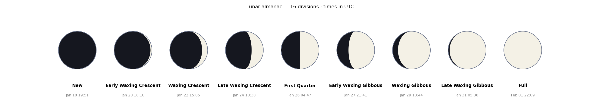

```bash
moonphase --start 2026-01-18T00:00Z --end 2026-02-02T00:00Z --divisions 16 --format almanac \
          --labels @samples/labels-16.txt \
          --out samples/almanac-2026-newfull-16div-labelled.png
```

---

## Light theme

Every chart defaults to the **dark** theme (above); `--theme light` renders a light variant.
In light mode the color (`--tint index`) heatmap has no black cell borders — cells are
separated by the background.

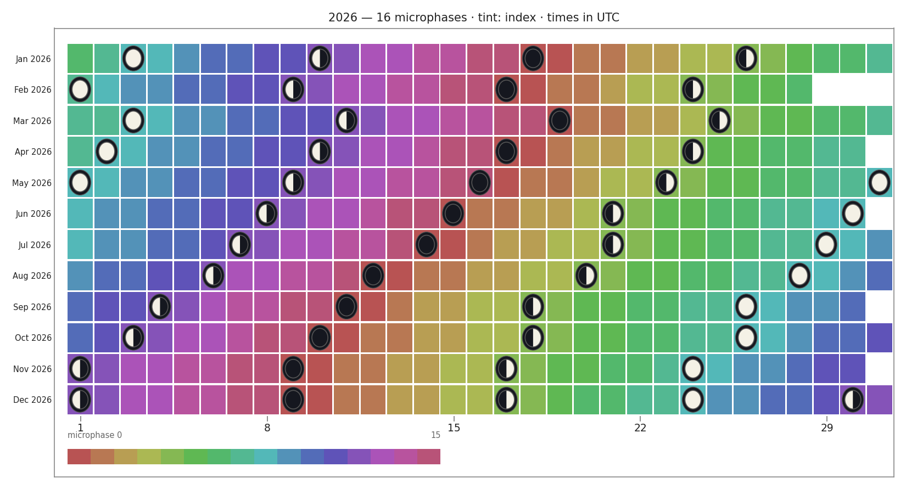

```bash
moonphase --start 2026-01-01T00:00Z --end 2026-12-31T23:00Z --divisions 16 \
          --format heatmap --tint index --theme light \
          --out samples/heatmap-gregorian-index-2026-16div-light.png
```
